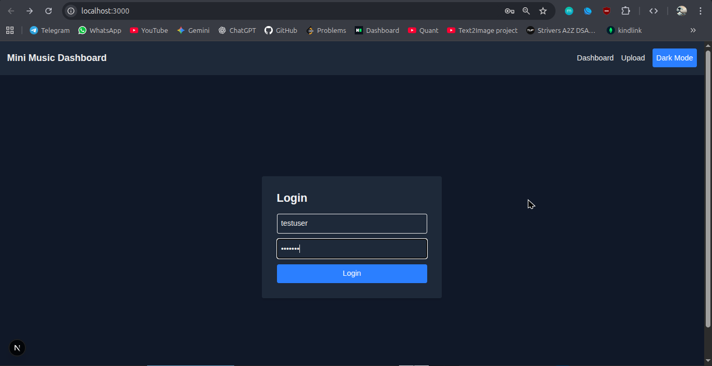
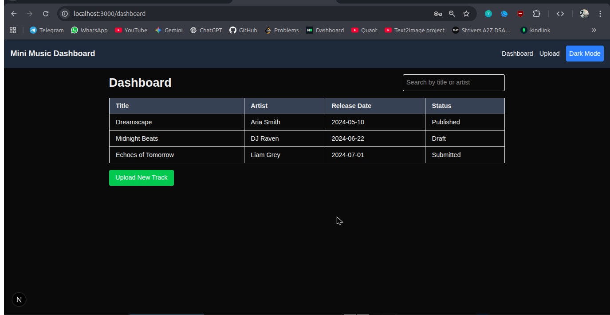
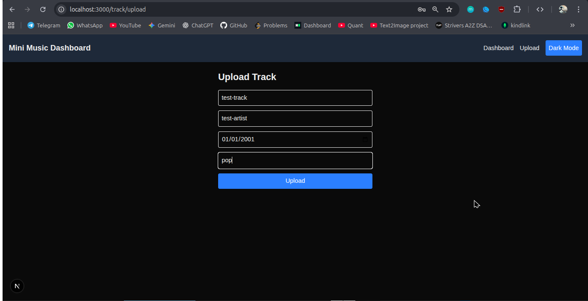
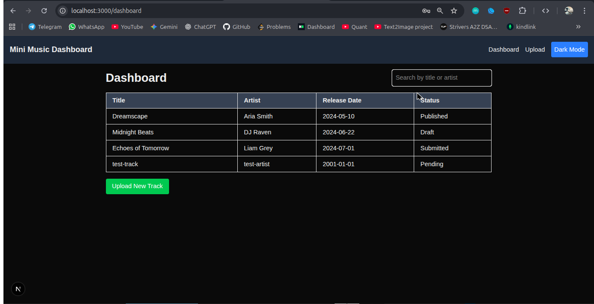
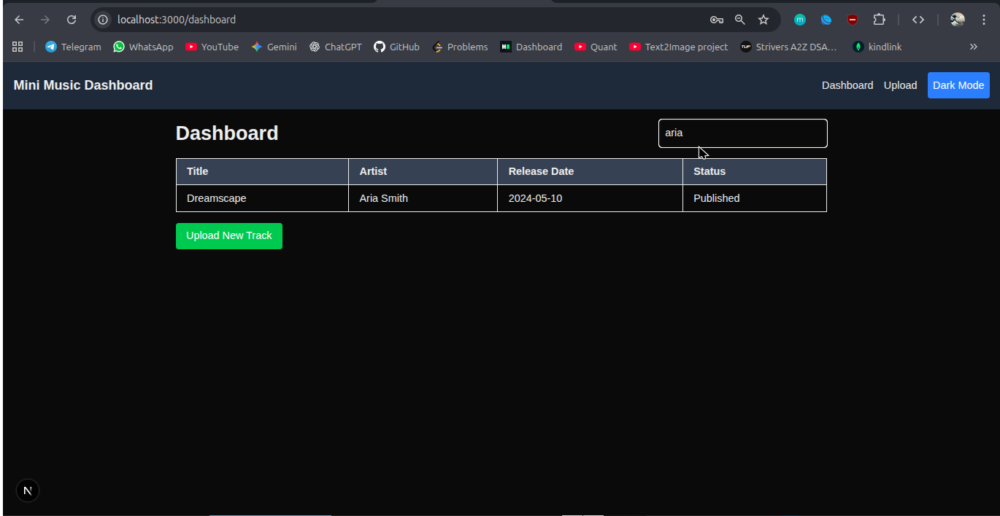

# Mini Music Distribution Dashboard

A simple **Next.js 15 + Tailwind CSS v4** dashboard for managing music tracks, built as a frontend assessment project. Includes login, track listing, uploading, details, search, and a theme toggle.  

---

## Table of Contents

- [Demo](#demo)  
- [Features](#features)  
- [Tech Stack](#tech-stack)  
- [Approach / How It Works](#Approach)   
- [Setup Instructions](#setup-instructions)   

---

## Demo






## Features

✅ **Login Page (Mock Authentication)**  
- Simple username/password form  
- Redirects to dashboard on login (mock validation)  

✅ **Dashboard Page**  
- Displays a list of tracks in a table: Title, Artist, Release Date, Status  
- Fetches data from Next.js API route (`/api/tracks`)  
- Search/filter by title or artist  

✅ **Track Upload Page**  
- Form to add new tracks (Track Title, Artist, Release Date, Genre)  
- Adds track to dashboard list via API POST request  

✅ **Track Details Page**  
- Dynamic route (`/track/[id]`)  
- Shows all track details, fetched from API  

✅ **Responsive Design**  
- Fully usable on desktop, tablet, and mobile  

---

## Tech Stack

- **Next.js 15** (App Router)  
- **React** (Functional Components + Hooks)  
- **Tailwind CSS v4**  
- Mock backend via **Next.js API Routes**  

---
## Approach

The project was built using **Next.js 15 App Router** and **Tailwind CSS v4**. The key decisions and approach were:

1. **Routing & Pages**  
   - **Login Page:** A client component with a mock authentication form. Uses `localStorage` to store the username.  
   - **Dashboard Page:** Lists tracks in a table. Fetches mock data from a Next.js API route.  
   - **Track Upload Page:** Form to add new tracks, which updates the mock API data.  
   - **Track Details Page:** Dynamic route (`/track/[id]`) fetching the selected track’s details.

2. **State Management**  
   - Used **React hooks** (`useState`, `useEffect`) to manage:  
     - User session (from `localStorage`)  
     - Tracks array  
     - Search/filter input  

3. **API Integration (Mock)**  
   - **Next.js API routes** (`app/api/tracks/route.js`) simulate a backend.  
   - Supports **GET** for fetching all tracks and **POST** for adding new tracks.  
   - Tracks are stored in memory (simple array) for this assessment.

5. **UI / UX Design**  
   - Responsive design using Tailwind CSS utilities (`flex`, `grid`, responsive prefixes).  
   - Simple and clean table layout for dashboard.  
   - Inputs and buttons styled consistently with hover/focus states.  
   - Search bar filters tracks by title or artist in real time.

6. **Bonus / Extra Effort**  
   - Search/filter on dashboard tracks.  
   - Responsive design verified for mobile, tablet, and desktop.


## Setup Instructions

1. **Clone the repo**
```bash
git clone https://github.com/Sachinp69/labellift-assignment
cd <repo-folder>
pnpm run dev